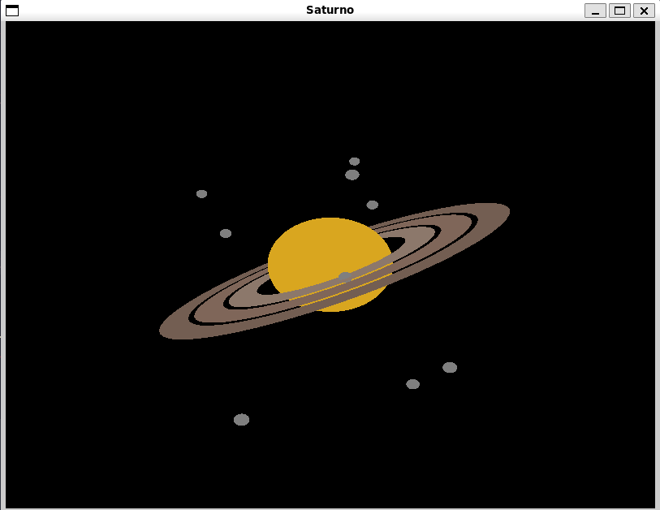

# DCA0114_Computer_Graphics

Esta é a implementação de um programa em C, que utilizando as bibliotecas do openGL, faz o desenho do planeta saturno e algumas luas.

- As variáveis rotationX e rotationY controlam a rotação da cena no eixo X e Y, respectivamente.
- As variáveis translateX e translateY controlam a translação da cena no eixo X e Y, respectivamente.
- A variável zoom controla o nível de zoom da cena.
- A função drawSphere desenha uma esfera com o raio especificado.
- A função drawRing desenha um anel com o raio interno, raio externo e número de slices especificados.
- A função drawScene é responsável por desenhar todos os elementos da cena, incluindo Saturno, os anéis e as luas.
- A função initialize realiza a inicialização das configurações iniciais do OpenGL.
- A função resize é chamada quando a janela é redimensionada.
- A função keyboard lida com eventos de teclado.
- A função mouse lida com eventos do mouse, incluindo o scroll para controle de zoom.
- A função motion lida com eventos de movimento do mouse quando um botão está pressionado.
- A função update é chamada periodicamente para atualizar as animações.
- A função main é o ponto de entrada do programa e inicializa a janela e os callbacks.
